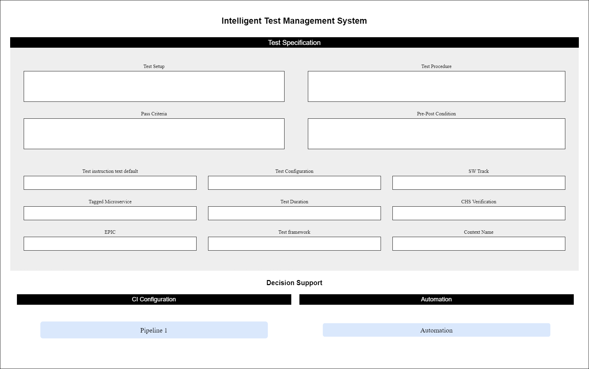
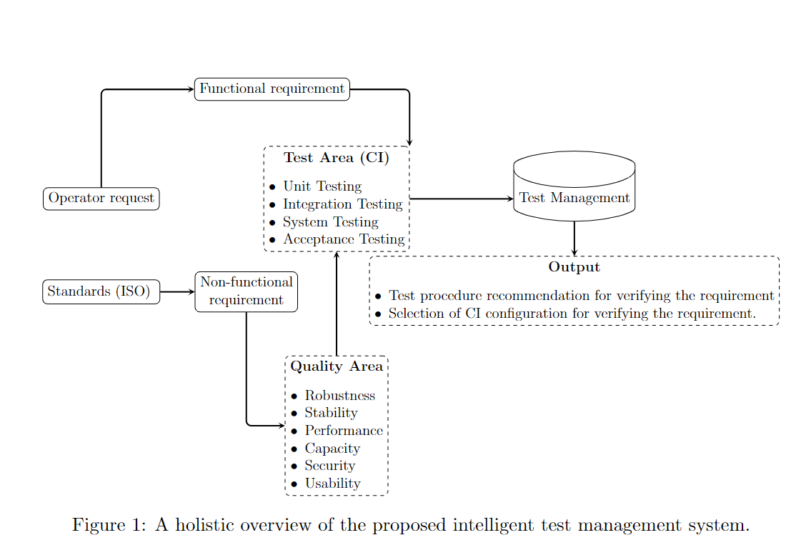
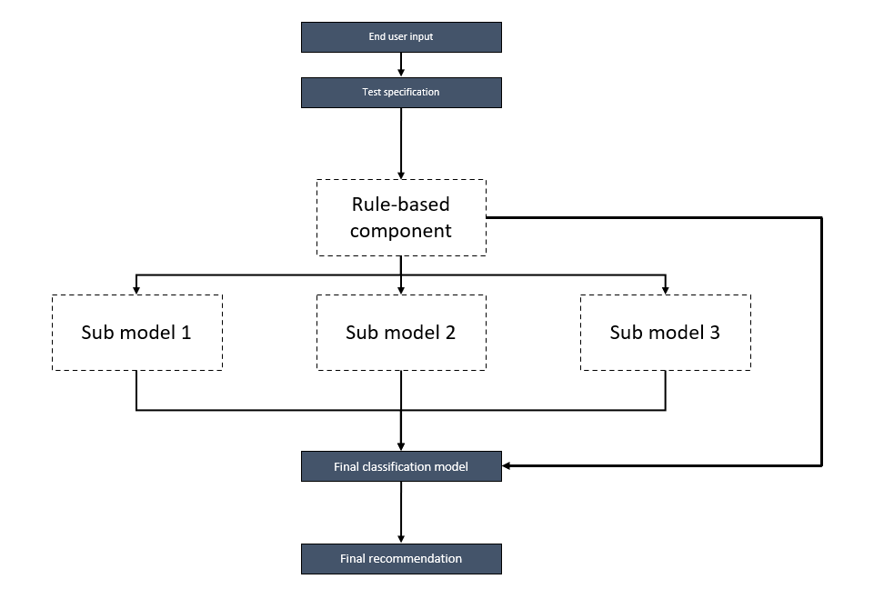
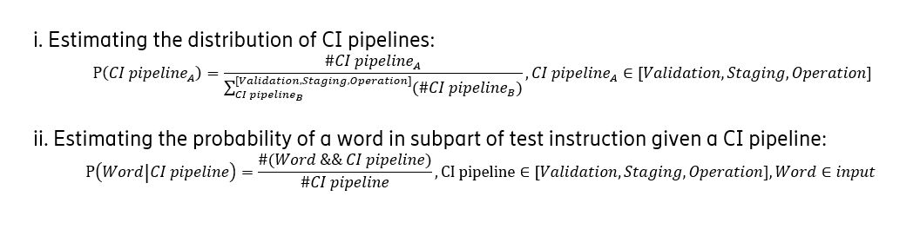
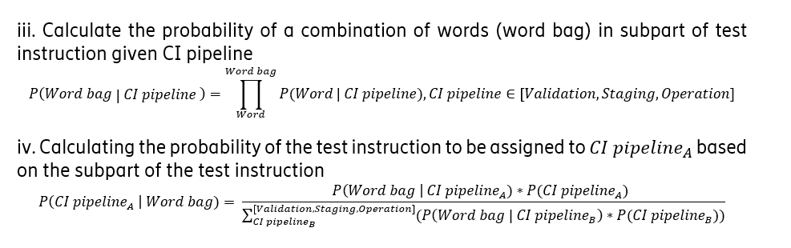
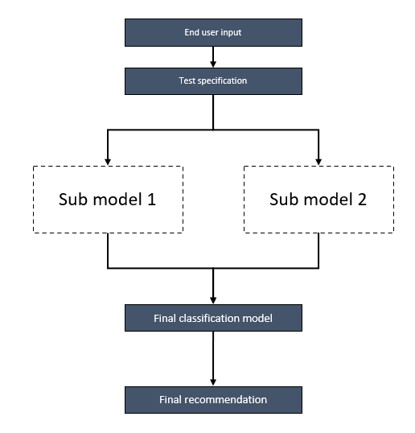

# ITMOS
This document serves as the comprehensive technical documentation for the "Intelligent Test Management System."

## Project overview

This system gives recommendations for CI configuration and test automation based on input test specifications. The system features an integrated graphical user interface (GUI) that provides a user-friendly experience for inputting test specifications and  interacting with the system. The recommendations are visually presented in the GUI and are generated based on the models' confidence in their predictions.

## Graphical Abstract
The proposed Intelligent Test Management System (ITMOS) integrates machine learning algorithms and automated workflows to enhance test management efficiency and accuracy. 

## Data Description
This synthetic dataset contains information related to tests conducted on test beds in a telecom industry. The dataset includes various attributes such as test setup, procedures, criteria, conditions, configurations, and more.

### Columns
1. **id**: Unique identifier for each test.
2. **Creation Date**: Date when the test was created.
3. **Status**: Current status of the test.
4. **Last Updated**: Date of the last update to the test.
5. **Test Setup**: Description of the test setup.
6. **Test Procedure**: Detailed procedure for conducting the test.
7. **Pass Criteria**: Criteria for determining the test pass condition.
8. **Pre Post Condition**: Conditions before and after the test.
9. **Test Instruction Text Default**: Default test instruction text.
10. **Test Configuration**: Configuration details for the test.
11. **SW Track**: Software track associated with the test.
12. **Tagged Microservice**: Microservice tagged with the test.
13. **Test Duration (weeks)**: Duration of the test in weeks.
14. **CHS Verification**: Verification status of CHS (Characteristics Specifications).
15. **EPIC**: EPIC associated with the test.
16. **Test Framework Text Default**: Default test framework text.
17. **Test Framework**: Framework used for conducting the test.
18. **Context_name**: Name of the test context.
19. **CI Configuration**: Continuous Integration Configuration value for each test (Target Value).
20. **Automation**: Value telling wheter the test needs to be automated or not (Target Value).

## System architecture
**1.1. AI expert CI Configuration**

**1.1.1. Overview of architecture**

The architecture of the ensemble model, visualized in Figure 2, incorporates a rule-based component along with three sub models. Each sub model specializes in handling a different aspect of the input. The input to the ensemble model is in the form of test specifications created based on the end user's input, as described in section 1.1. Each test specification includes a test instruction in natural language and categorical data. The rule-based component of the ensemble considers the length of the test instructions in the test specification. Sub model 1 focuses on capturing the semantic meaning of the test instructions. Sub model 2 deals with the statistical distribution of words in the test instructions. Sub model 3 utilizes the categorical data in the test specification. The output from each sub model is used as input to the final classification model in the ensemble which outputs the final recommendation.

**1.1.2. Rule-based component**

The rule-based component of the AI-expert considers the number of characters of each subpart of the test instruction inputted in the test specifications. The rule assigns test specifications to the CI configuration operation under certain conditions. Specifically, if the number of characters in the pre/post-condition section of the test instruction is greater than 1000 or if the number of characters in the pass criteria section is greater than 800, then the test specification should be assigned to the CI configuration operation. The rules used in the rule-based component are derived from manually analysing the dataset. Note that the specific threshold for the rules is subject to changes when the solution is implemented for another domain.

**1.1.3. Sub-models**

Semantic classifier for CI configuration: The input to the semantic classifier consists of the four subparts of the test instruction: test setup, pre/post-conditions, test procedure, and pass criteria, all of which are in natural language form. To capture the semantic and syntactic information of these texts, the subparts are converted into word embeddings using pre-trained FastText embeddings, which are 300-dimensional vectors. The pre-trained word embeddings were trained on the datasets Common Crawl and Wikipedia. The embeddings are fed into individual Random Forest classifiers, one for each subpart of the test instruction. Each specific Random Forest classifier employs the Gini impurity as cost function to make predictions for the corresponding subpart. As a result, the semantic model generates four three-element vectors, one for each subpart, where each element represents the confidence that a test specification belongs to a certain CI configuration.

Word-distribution classifier: Similar to the semantic classifier, the input for the word-distribution classifier consists of the four subparts of the test instruction: test setup, pre/post-conditions, test procedure, and pass criteria. The word distribution model takes a test instruction as input and outputs four three-element vectors, each representing the probability of the test cases belonging to the three CI configurations. Each three-element vector is the classification for each part of the test instruction. Below is an overview of the training and classification process of the word-distribution classifier.

Training: During the training of the model, statistics about the training data are collected. The model estimates the conditional probability that a specific word occurs given a CI configuration. It also calculates the distribution of the CI configurations in the training data. Both the conditional probability of words and the distribution of CI configurations are calculated and stored separately for each of the four subparts of the test instruction. The distributions were calculated from the training data using the following equations:

Classification: To classify test specifications, the model calculates the conditional probability of a word bag given a particular CI configuration. It does this by taking the product of all the conditional probabilities for the words in the word bag given the CI configuration, which were calculated and stored when the model was trained. Although this method assumes that the words are independent of each other, which is not always true, the impact of this assumption on the accuracy of the model is negligible. The conditional probability of the word bag given a CI configuration is calculated for all three CI configurations. The conditional probability of a CI configurations given a word bag is then given by the quotient of the conditional probability of the word bag given a test level divided by the sum of the conditional probability of the word bag given a CI configuration, where the sum loops through all possible CI configurations. These three conditional probabilities are the probabilities that the model outputs. As a result, the word-distribution model generates four three-element vectors, one for each subpart of the test instruction, where each element represents the confidence that a test specification belongs to a certain CI configuration. 

If a word that has not been seen during the training phase occurs during prediction, the model will assign all probabilities for that word to a very small number. To estimate the probabilities, the following equations are used:

Categorical data classification for CI configuration: The categorical data sub model leverages the categorical information provided by the end user in the test specifications (as detailed in section 4.1b) to generate recommendations. A one-hot encoder is utilized in this implementation to encode the categorical data. This encoder creates binary columns for each possible value of the categorical data in the test specification. The resulting one-hot encoded categorical data is then fed into a random forest model that uses the Gini impurity as the cost function for making recommendations. The categorical data sub-model output is a three-element array, where each element represents the probability that the test specification belongs to each CI configuration.

Final classification: The final model in the ensemble takes a 27-element vector as input, which is created by concatenating the outputs from the sub models. This concatenated vector is then fed into a machine learning classifier. This implementation uses a random forest with Gini impurity as a cost function. The output of the final model is a three-element vector representing the model's confidence in assigning the test specification to different CI configurations.

**1.2. AI-expert automation**

**1.2.1 Overview of architecture**

The AI-expert for automation’s ensemble model, depicted in Figure 3, comprises of two sub-models that specialize in handling different aspects of the input. The input to the ensemble model is in the form of test specifications created based on the information provided by the end user in section 4.1.b. Sub-model 1 captures the semantic meaning of the test specification description, while sub-model 2 utilizes the categorical data in the test specification. The final recommendation is obtained by using the output from each sub-model as input to the final classification model in the ensemble.

  

**1.2.2 Sub-models**

**Semantic classifier for automation:** The semantic classifier for automation takes in a test specification described in natural language as its input. To capture the underlying meaning of the text, the description is first converted into word embeddings using pre-trained FastText embeddings. These embeddings are then fed into a random forest that utilizes the Gini impurity as the cost function to make predictions about whether the test specification should be automated or not. The output from the semantic classifier for automation is a list with two elements, indicating the level of confidence for automating or not automating the specific test specification.

Categorical data classification for automation: The AI-expert uses categorical data from the test specification, as provided by the end user in the GUI, along with the predicted CI configuration given by the AI-expert in section 4.2, to generate recommendations for automation. The data is encoded using a one-hot encoder to transform it into one-hot encoded format. Subsequently, the encoded data is fed into a random forest classifier, which utilizes Gini impurity as the cost function. The output from the random forest classifier is a two-element array, where each element represents the AI-expert's confidence level regarding whether a test case should be automated.

**Final classification for automation:** The final model in the ensemble takes a 6-element vector as input, which is created by concatenating the outputs from the two sub models for automation. This concatenated vector is then fed into a support vector machine. This implementation uses a support vector machine with C-SVM as a cost function. The output of the final model is a two-element vector representing the model's confidence in automation the test specification or not.

**1.3. Visualization of recommendation**

In section 1.4 of Figure 2, the AI-based experts’ recommendations are displayed, which are determined based on the test specification input by the user. The CI configuration with the highest confidence is selected as the recommended configuration. 

The recommendation and the AI-expert’s confidence regarding automating is given by the highest confidence. 

The ultimate decision of the CI configuration and automation for a test specification is made by a domain expert. The final decision, as provided by the domain expert, is entered into the web portal and then propagated to the TMS.
